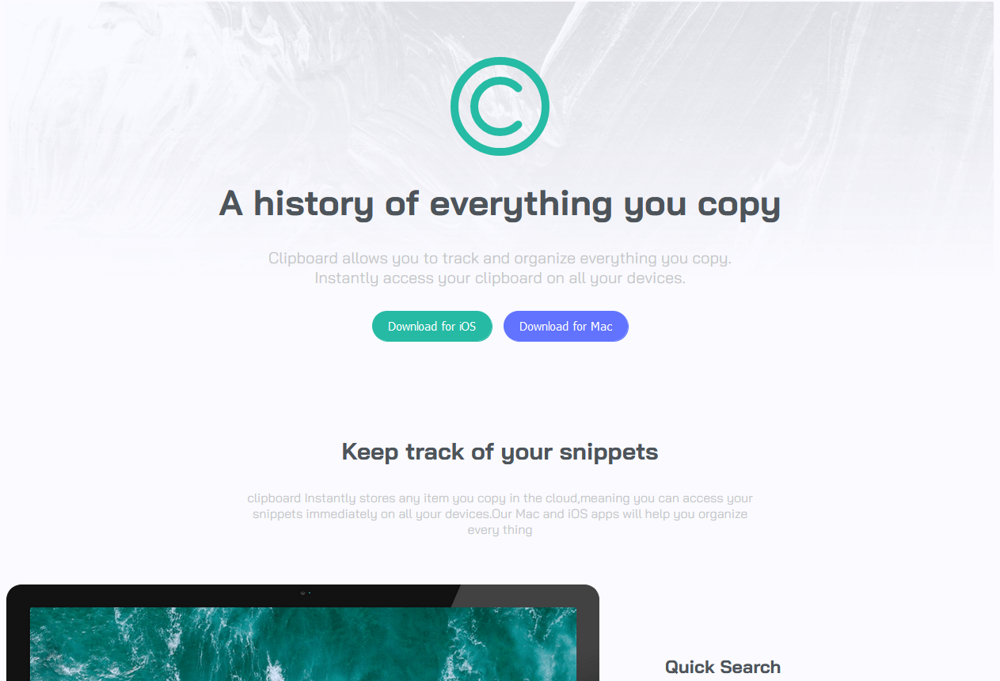
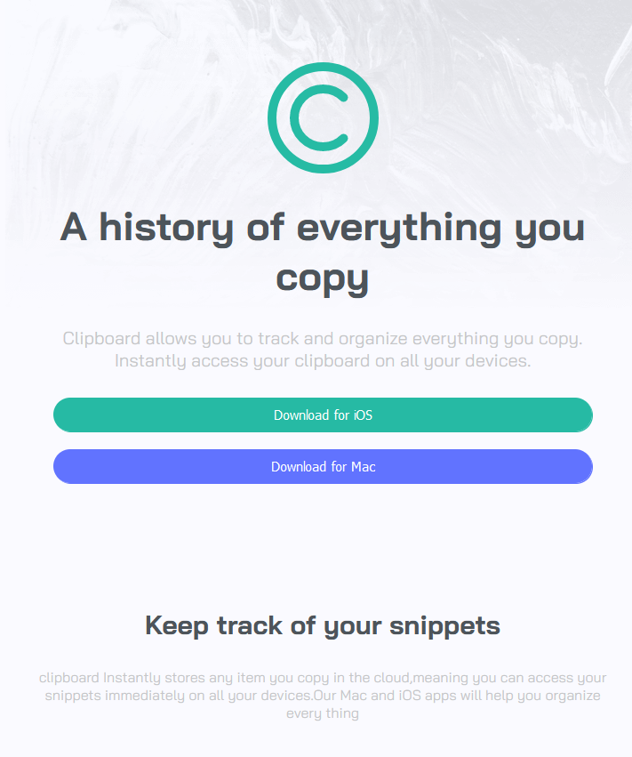

# clipboard-landing-page

## Table of contents

- [Overview](#overview)
  - [Screenshot](#screenshot)
  - [Links](#links)
- [My process](#my-process)
  - [Built with](#built-with)
  - [What I learned](#what-i-learned)
  - [Useful resources](#useful-resources)
- [Author](#author)

## Overview
this website shows an application that designed to help you..it keeps your copied data save!!
you can scan your data and it will be stored  and you can access to your data  any time!.

### Screenshot

### Links

- Solution URL: [Add solution URL here](https://your-solution-url.com)
- Live Site URL: [Add live site URL here](https://your-live-site-url.com)

## My process

### Built with

- Semantic HTML5 markup
- CSS custom properties
- Flexbox
- SASS

### What I learned

I learn how to make a website with HTML & CSS ,style the elements , how to position the elements and how to make the website responsive. 

### Useful resources

- [resource 1](https://fontawesome.com) - This helped me for putting icons reason. I really liked this pattern and will use it going forward.
- [resource 2](https://fonts.google.com/specimen/Bai+Jamjuree) - This is an amazing website which helped me for styling the website font.

## Author
- Frontend Mentor - [@Hajerabdeen](https://www.frontendmentor.io/profile/Hajerabdeen)

